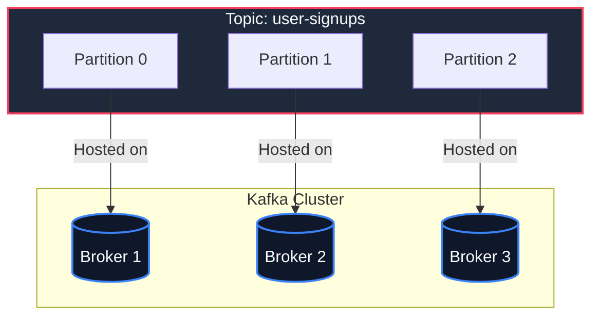
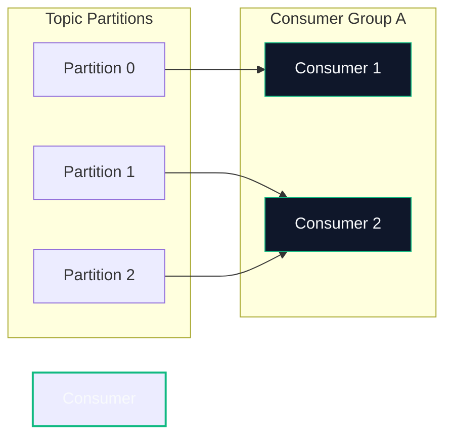

# 🏁 Kafka Core Concepts: The Distributed Commit Log

To understand Apache Kafka, you must discard traditional messaging system paradigms. Kafka is a **highly optimized, distributed, horizontally scalable append-only commit log**.

Let's explore the fundamental building blocks that make up this storage architecture.

---

## 🧱 The Core Building Blocks



### 1. Brokers
A **Broker** is a single Kafka server that runs the Kafka process. A group of brokers forms a **Kafka Cluster**.
*   **Role:** Brokers receive messages from producers, write them to disk, and serve them to consumers.
*   **Scalability:** You can scale a cluster horizontally by simply spinning up new brokers; they register themselves to the cluster dynamically.

### 2. Topics & Partitions
An event-stream in Kafka is categorized into a **Topic** (e.g., `user-signups`, `payment-transactions`).
*   **Partitions:** Topics are split into multiple **Partitions** (often distributed across different brokers). 
*   **Append-Only:** Each partition is a structured, ordered, append-only commit log. Every write is sequential, making operations extremely fast ($O(1)$ disk I/O).
*   **Ordering:** Strict message ordering is guaranteed **only within a single partition**, not across the entire topic.

```
Partition 0 Log:
┌───────────┬───────────┬───────────┬───────────┬───────────┐
│ Offset: 0 │ Offset: 1 │ Offset: 2 │ Offset: 3 │ Offset: 4 │  <--- Append Next
└───────────┴───────────┴───────────┴───────────┴───────────┘
```

### 3. Log Segments: How Kafka Stores Data on Disk
Brokers do not store all partition data in a single giant file. Instead, they divide each partition directory into **Log Segments** on the file system:
*   **Active Segment:** The current segment that Kafka is actively writing to.
*   **Closed Segments:** Read-only segments. When the active segment reaches its limit (default: `1 GB` or `7 days`), it is closed, and a new active segment is created.
*   **Key Configs:**
    *   `log.segment.bytes`: Maximum size of a segment file (default `1,073,741,824` bytes / 1GB).
    *   `log.roll.hours`: Maximum age of a segment file before rolling over (default `168` hours / 7 days).

---

## 👥 Consumers, Consumer Groups & Offsets

Kafka shifts the responsibility of tracking read state from the broker to the consumer. This is called the **client pull model**.



### 1. Consumer Offsets
As a consumer reads messages from a partition, it tracks its position using a sequential integer called the **Offset**.
*   **__consumer_offsets:** Consumers commit their read progress to a special internal Kafka topic called `__consumer_offsets`.
*   **Recovery:** If a consumer crashes, a replacement consumer can join the group, read the last committed offset from `__consumer_offsets`, and resume processing without losing or duplicating data.

### 2. Consumer Groups
Multiple consumers can form a **Consumer Group** to parallelize the ingestion of a high-throughput topic.
*   **Partition Ownership:** Kafka guarantees that a single partition is assigned to **at most one consumer** in a group at any given time.
*   **Scale Limitation:** If you have more consumers in a group than partitions in a topic, the extra consumers will remain idle, acting as hot backups.
    > [!TIP]
    > To achieve higher consumer parallelism, design your topics with a sufficient number of partitions (e.g., 6, 12, or 24 partitions depending on your throughput needs).

### 3. Rebalancing & Partition Assignment Strategies
When a consumer joins or leaves a group, the **Group Coordinator** (a broker assigned to manage that consumer group) triggers a **Rebalance**. This redistributes partition ownership among the active members.
*   **RangeAssignor (Default):** Works on a per-topic basis. It divides partitions of each topic into contiguous ranges and assigns them to consumers.
*   **RoundRobinAssignor:** Lays out all available partitions and consumers, and distributes them in a cyclic, round-robin fashion. Highly effective if all consumers consume from the same set of topics.
*   **CooperativeStickyAssignor:** Minimizes overhead by performing "incremental" rebalances. It only shifts partitions that absolutely need to be moved, leaving other consumers undisturbed during the rebalance.

---

## 🧹 Retention Policies: Cleaning Up the Log

Kafka retains messages regardless of whether they have been consumed. There are two primary cleanup strategies, configured using `cleanup.policy`:

### A. Delete Policy (`cleanup.policy=delete`)
Deletes old log segments when they exceed predefined thresholds.
*   `log.retention.hours`: Time-based threshold (default: `168` hours / 7 days).
*   `log.retention.bytes`: Size-based threshold (default: `-1` / infinite).

### B. Compact Policy (`cleanup.policy=compact`)
Guarantees that for any given key, Kafka will keep at least the **most recent value** in the log.
*   **Use Case:** Highly useful for maintaining state tables (e.g., storing the latest profile updates for a user ID) where old updates are obsolete.
*   **Mechanism:** A background broker thread called the **Log Cleaner** regularly compresses the closed segments, leaving only the latest record for each key.

```
Before Compaction:
┌───────────┬───────────┬───────────┬───────────┐
│ Key: A    │ Key: B    │ Key: A    │ Key: C    │
│ Value: V1 │ Value: V1 │ Value: V2 │ Value: V1 │
└───────────┴───────────┴───────────┴───────────┘

After Compaction:
┌───────────┬───────────┬───────────┐
│ Key: B    │ Key: A    │ Key: C    │
│ Value: V1 │ Value: V2 │ Value: V1 │
└───────────┴───────────┴───────────┘
```

---
*Next up, let's explore how Kafka manages cluster coordination and why ZooKeeper is no longer required:* **[02. KRaft vs ZooKeeper ➡️](./02-kraft-vs-zookeeper.md)**
