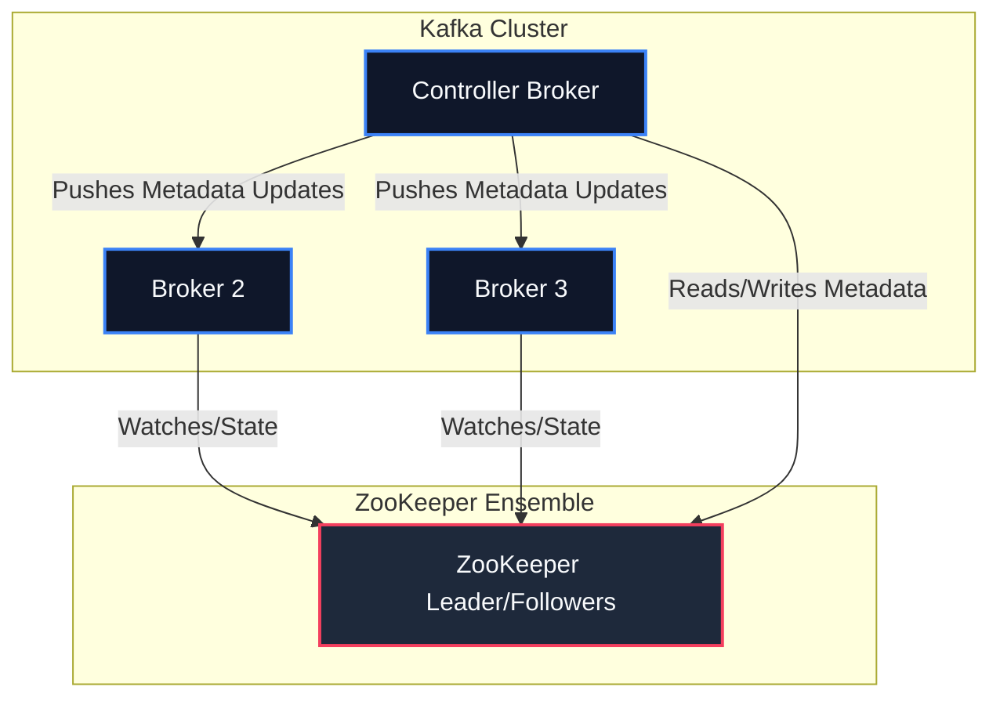
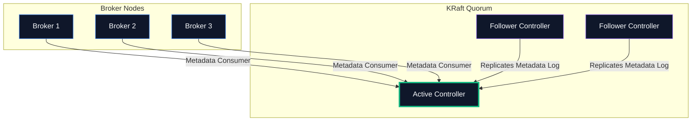

# 🛡️ KRaft vs. Legacy ZooKeeper: Cluster Coordination Evolution

In modern Apache Kafka (v3.x+), the architecture has undergone its most significant evolutionary change: the complete removal of the **Apache ZooKeeper** dependency in favor of **KRaft (Kafka Raft Metadata Mode)**.

Let's understand why this transition occurred, how KRaft functions internally, and what it means for enterprise deployments.

---

## 🏛️ The ZooKeeper Architecture (Legacy)

Traditionally, Kafka relied on ZooKeeper to store cluster metadata, broker registries, topics, and configuration states.



### The Bottleneck
In a ZooKeeper-based cluster, only **one broker** is elected as the **Controller**. 
1. The Controller is responsible for managing partition states, leader elections, and pushing updates to all other brokers.
2. The Controller must synchronize all metadata with the external ZooKeeper ensemble.
3. If the Controller broker crashes, the cluster must elect a new controller. The new controller has to load the *entire* state of the cluster from ZooKeeper into memory before it can resume normal operations.
4. **Limits:** This loading process could take several minutes, limiting the total partition count in a cluster to roughly 200,000 partitions.

---

## ⚡ The KRaft Architecture (Modern Standard)

In KRaft mode, cluster metadata management is moved **directly into Kafka itself**. External consensus (ZooKeeper) is completely eliminated. 

Instead of an external system, a subset of brokers are designated as **Controllers**. These controllers form a quorum using a customized consensus algorithm based on Raft.



### How KRaft Works
*   **Active Controller:** One controller node is elected as the **Active Controller**.
*   **Metadata Partition (`@metadata`):** Metadata is stored in a special, single-partition internal topic named `@metadata`.
*   **Standby Controllers:** The other controller nodes replicate the `@metadata` partition log. They maintain a fully updated, in-memory copy of the cluster state.
*   **Broker Updates:** Standard broker nodes read updates from the `@metadata` partition to stay in sync with the active controller.

> [!NOTE]
> **Sub-Second Failover:** Because standby controllers keep the entire cluster state pre-loaded in their memory logs, if the Active Controller fails, a new Active Controller takes over **instantly (sub-second recovery)**.

---

## 📊 Key Operational & Architecture Comparison

| Feature | Legacy ZooKeeper | Modern KRaft |
| :--- | :--- | :--- |
| **External Dependency** | Yes (Apache ZooKeeper Ensemble) | **No (Self-contained)** |
| **Maximum Partition Limit**| ~200,000 per cluster | **Millions (Unlimited theoretical)** |
| **Controller Failover Time**| Minutes (Slow metadata loading) | **Sub-second (Warm memory standbys)** |
| **Security Configuration**| Complicated (Two separate security layers) | **Unified (Single security context)** |
| **Deployment Complexity** | High (Managing JVMs, configurations, disks) | **Low (Single binary configuration)** |

---

## ⚙️ Practical Configuration Differences

When setting up your clusters (Module 2), look for these key structural changes in the configuration properties:

### 1. The Connection String
*   **ZooKeeper:**
    ```properties
    zookeeper.connect=zookeeper1:2181,zookeeper2:2181/kafka
    ```
*   **KRaft:**
    ```properties
    process.roles=broker,controller
    controller.quorum.voters=1@controller1:9093,2@controller2:9093
    ```

### 2. Node Roles
In KRaft, a node can act as:
*   `process.roles=broker`: Node only stores standard topic partitions.
*   `process.roles=controller`: Node only manages metadata and participates in the Raft quorum.
*   `process.roles=broker,controller`: Combined mode (highly popular for local development and small-scale testing clusters).

---
*Now that we understand the cluster topology, let's explore message delivery durability and transactional safety:* **[03. Delivery Guarantees ➡️](./03-delivery-guarantees.md)**
