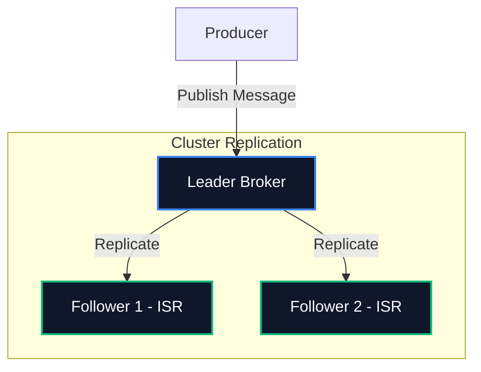
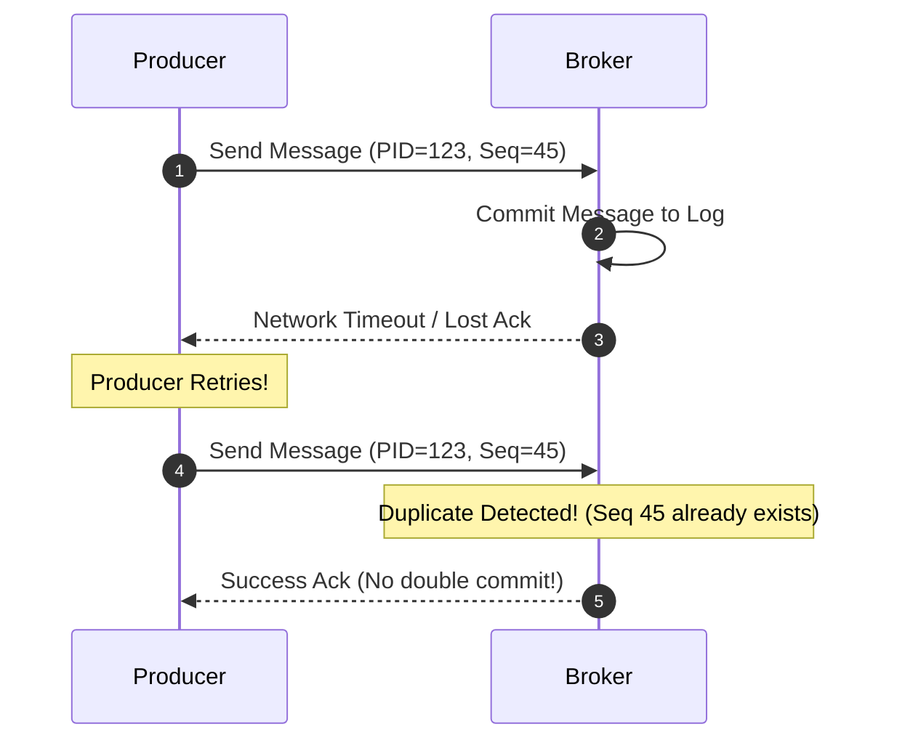

# 🎯 Delivery Guarantees & Transactional Semantics

Distributed systems must operate reliably over unreliable networks. When writing applications with Apache Kafka, understanding how messages are written, replicated, and acknowledged is critical to preventing **data loss** or **duplicate processing**.

---

## 🛡️ Producer Acknowledgements (`acks`)

When a producer publishes a message to a partition, it tells the partition's leader broker how many replication copies must record the write before returning a success code. This is configured via `acks`:



### 1. `acks=0` (Fire and Forget)
*   **Mechanism:** The producer sends the message and immediately considers it successfully written. It does not wait for *any* reply from the broker.
*   **Trade-off:** Maximum throughput, highest danger of data loss. If the broker was offline, crashed, or encountered disk full, the producer will never know.

### 2. `acks=1` (Leader Acknowledgement)
*   **Mechanism:** The producer waits until the partition **Leader** broker successfully writes the message to its local append-only log. It does not wait for replicas to copy it.
*   **Trade-off:** Balanced throughput. However, if the leader broker crashes *immediately* after acknowledging but before followers replicated the write, that message is permanently lost.

### 3. `acks=all` (or `acks=-1`) (Resilient Cluster Acknowledgement)
*   **Mechanism:** The producer waits until the partition Leader and **all current In-Sync Replicas (ISR)** have acknowledged the write.
*   **Durability Guarantee:** Combining `acks=all` with a strict `min.insync.replicas` setting guarantees the message survives even if the leader crashes and a follower takes over.

> [!IMPORTANT]
> **The `min.insync.replicas` Guardrail:**
> If a topic has a replication factor of 3, and you set `min.insync.replicas=2` on the broker, writes with `acks=all` will succeed only if at least 2 brokers (the leader + 1 follower) are active and in-sync. If 2 brokers crash, the topic becomes **read-only**—new writes will throw `NotEnoughReplicasException` rather than risking un-replicated commits.

---

## 🔄 The Three Event Delivery Semantics

How your producer, brokers, and consumer are configured determines the exact processing guarantees:

```
┌─────────────────────────────────────────────────────────────┐
│ 1. At-Most-Once   : Zero Duplication (Risk of Loss)         │
│ 2. At-Least-Once  : Zero Loss (Risk of Duplication)         │
│ 3. Exactly-Once   : Zero Loss & Zero Duplication            │
└─────────────────────────────────────────────────────────────┘
```

### 1. At-Most-Once
*   **Concept:** Messages may be lost, but will never be processed twice.
*   **Consumer Setup:** Consumer reads a batch of messages, **immediately commits the offset**, and *then* processes the records.
*   **Failure Case:** If the consumer crashes halfway through processing, the new consumer starts *after* those offsets, resulting in lost records.

### 2. At-Least-Once (Default Production Practice)
*   **Concept:** Messages will never be lost, but might be processed multiple times (requires idempotent consumer designs).
*   **Consumer Setup:** Consumer reads a batch, processes the records successfully, and **only then commits the offset** back to Kafka.
*   **Failure Case:** If the consumer crashes halfway through processing, the new consumer re-reads the entire batch from the last committed offset, leading to duplicates.

### 3. Exactly-Once Semantics (EOS)
*   **Concept:** Message delivery and processing happens exactly once, guaranteeing transactional state consistency across multiple topics.
*   **Implementation:** Requires **Idempotent Producers** and **Transactional Consumer-Producer Loops** (`read_committed` mode).

---

## ⚡ Exactly-Once Under the Hood

Exactly-Once Semantics is achieved by combining two core mechanisms: **Idempotent Producers** and the **Transactional Coordinator**.

### A. Idempotent Producers (`enable.idempotence=true`)
Solves network-level duplicates when a broker acknowledges a write but the ACK is lost in transit.



*   **Producer ID (PID):** Every producer is assigned a unique PID by the cluster upon initialization.
*   **Sequence Numbers:** Each batch of messages sent to a partition receives an incrementing sequence number. 
*   **Deduplication:** The broker keeps track of the largest sequence number committed per partition. If it receives a sequence number that has already been recorded, it ignores the write but sends a success ACK back to the producer.

### B. Transactional Coordinator & Multi-Partition Writes
Used for **Read-Process-Write** loops (e.g., reading from topic A, processing data, and publishing results to topic B while committing offsets).

1.  **Transaction Coordinator:** A specialized broker manages transactional logs (`__transaction_state`).
2.  **Transactional ID:** The producer is configured with a persistent `transactional.id`.
3.  **Atomic Commits:** The coordinator writes a commit marker to the transaction log once all writes to all partitions succeed.
4.  **Read Committed:** Downstream consumers configured with `isolation.level=read_committed` will skip uncommitted messages or transaction aborts, exposing only fully committed records.

---
*Now that we have covered the conceptual architecture, let's learn how to spin up these configurations locally in Module 2:* **[02. Cluster Setups ➡️](../02-cluster-setups/)**
