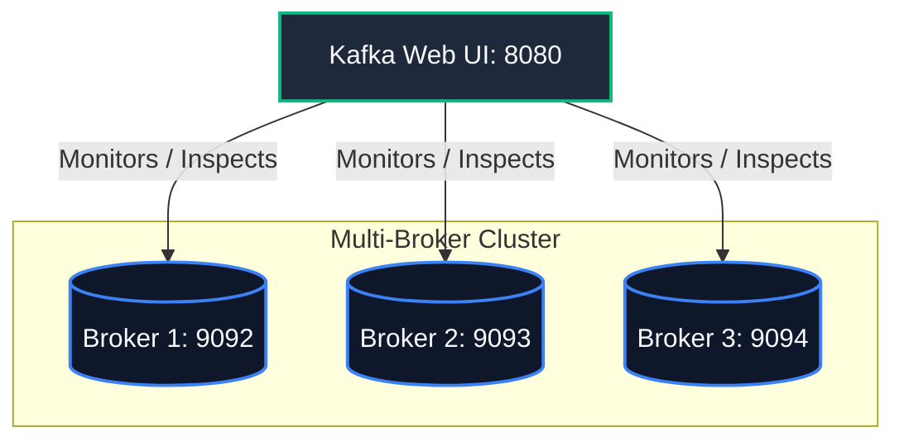

# 🖥️ Multi-Broker KRaft Cluster with Web UI

This setup spins up a highly resilient, 3-broker cluster operating in **KRaft** mode, complete with a visual dashboard for administration and real-time data inspection.

---

## 🏗️ Architecture Layout

*   **Kafka Broker 1:** `localhost:9092`
*   **Kafka Broker 2:** `localhost:9093`
*   **Kafka Broker 3:** `localhost:9094`
*   **Kafka UI Management Dashboard:** **[http://localhost:8080](http://localhost:8080)**



---

## 🚀 How to Run

1.  **Spin Up the Cluster:**
    ```bash
    docker compose up -d
    ```

2.  **Verify Running Containers:**
    ```bash
    docker compose ps
    ```
    Ensure that all three brokers and the `kafka-web-ui` container are listed as `Up`.

3.  **Access the UI:**
    Open your browser and navigate to **[http://localhost:8080](http://localhost:8080)**. Here, you can:
    *   Inspect broker metadata and node states (Active controller, ISR status).
    *   Create, configure, repartition, or delete topics.
    *   Produce and view raw JSON/String messages in real-time.
    *   Track active consumer groups and partition lag offsets.

---

## 🧪 Resiliency Testing: Simulating Failover

One of the best advantages of a multi-broker setup is seeing replication in action.

### 1. Create a Replicated Topic
Create a topic with a replication factor of 3 and 6 partitions:
```bash
docker exec -it kafka-broker-1 kafka-topics --create --topic replicated-orders --partitions 6 --replication-factor 3 --bootstrap-server localhost:9092
```

### 2. Check Partition Leaders
Describe the topic to see which broker leads each partition:
```bash
docker exec -it kafka-broker-1 kafka-topics --describe --topic replicated-orders --bootstrap-server localhost:9092
```
Notice the `Leader` and `Isr` (In-Sync Replicas) lists for each partition.

### 3. Kill a Broker Node
Let's simulate a hardware failure by turning off **Broker 2**:
```bash
docker compose stop kafka-2
```

### 4. Verify Automatic Failover
Immediately describe the topic again:
```bash
docker exec -it kafka-broker-1 kafka-topics --describe --topic replicated-orders --bootstrap-server localhost:9092
```
Observe that:
*   Any partition previously led by Broker 2 (`Leader: 2`) has been successfully reassigned to either Broker 1 or Broker 3.
*   Broker 2 is removed from the `ISR` lists.
*   **The cluster remains fully operational and writable!**

---

## 🧹 Clean Up

To tear down the cluster and release system resources:
```bash
docker compose down -v
```
