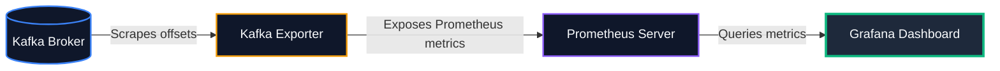

# 📊 Kafka Production Monitoring Stack

This directory contains a complete, out-of-the-box cluster telemetry setup. It simulates a production-grade infrastructure monitoring layout using **Prometheus** to scrape metrics, and **Grafana** to visualize them in real-time.

---

## 🏗️ Architecture Layout

*   **Kafka Broker:** `localhost:9092` with JMX exposed on port `9999`
*   **Kafka Prometheus Exporter:** `localhost:9308` (scrapes topic and consumer group offsets)
*   **Prometheus Server:** **[http://localhost:9090](http://localhost:9090)**
*   **Grafana Dashboard:** **[http://localhost:3000](http://localhost:3000)** (Username/Password: `admin` / `admin`)



---

## 🚀 How to Run

1.  **Spin Up the Stack:**
    ```bash
    docker compose up -d
    ```

2.  **Verify Running Containers:**
    ```bash
    docker compose ps
    ```
    Ensure `kafka-monitored`, `kafka-metrics-exporter`, `prometheus-server`, and `grafana-dashboard` are all running.

3.  **Explore the Grafana Dashboard:**
    *   Navigate to **[http://localhost:3000](http://localhost:3000)**.
    *   Sign in using the credentials:
        *   **Username:** `admin`
        *   **Password:** `admin`
    *   Go to **Dashboards** (left sidebar) -> click on the **Kafka** folder -> open the **"Apache Kafka Overview Cluster Dashboard"**.
    *   You will see active panels for broker count, topics, partitions, and empty placeholder graphs for offsets and consumer lag.

---

## 🧪 Interactive Walkthrough: Visualizing Consumer Lag

Let's generate data and a slow consumer so we can see the telemetry graphs come alive!

### 1. Create a Dynamic Topic
```bash
docker exec -it kafka-monitored kafka-topics --create --topic telemetry-orders --partitions 4 --replication-factor 1 --bootstrap-server localhost:9092
```
*Look at the Grafana dashboard — the "Total Cluster Topics" count will instantly update to include the new topic!*

### 2. Flood the Topic with Messages (High Load)
We will write a loop to generate a stream of messages to simulate heavy incoming traffic:
```bash
docker exec -it kafka-monitored bash -c "for i in {1..200}; do echo 'order-\$i:{\"item_id\":102,\"quantity\":2}' | kafka-console-producer --topic telemetry-orders --bootstrap-server localhost:9092; sleep 0.1; done"
```

### 3. Start a Lagging/Slow Consumer Group
While the producer is running, spin up a console consumer assigned to a group named `billing-service`:
```bash
docker exec -it kafka-monitored kafka-console-consumer --topic telemetry-orders --group billing-service --bootstrap-server localhost:9092
```

### 4. Observe the Telemetry in Grafana
*   **Production Rate Graph:** You will see a spike showing the write rate (offsets per second) climbing.
*   **Consumer Group Lag Graph:** If you stop the consumer (press `Ctrl+C`) while the loop is still producing, you will instantly see the **Consumer Group Lag** line spike upward on the graph, detailing exactly how many messages are pending!
*   **Recovery:** Re-run the consumer command, and watch the lag line plunge back to zero as the consumer catches up.

---

## 🧹 Clean Up
```bash
docker compose down -v
```
