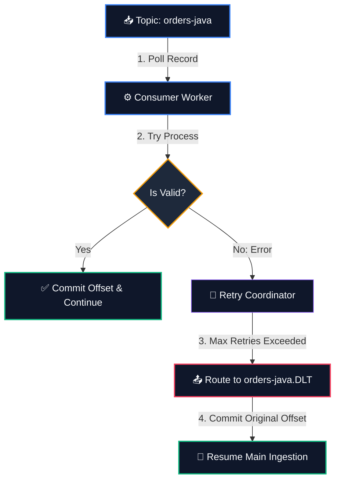

# 🚨 Dead Letter Queue (DLQ) Integration Pattern

In high-throughput event streaming, you will eventually encounter a **"Poison Pill"**—a message written to a partition that is syntactically invalid (e.g., corrupt bytes, empty fields, or failed JSON parses) or violates critical business rules.

If your consumer throws an exception and crashes without committing the offset, it will fetch the *same* bad message again upon restart, entering an **infinite crash loop** that blocks all subsequent valid messages in the partition.

---

## 🛠️ The DLQ Design Pattern

The Dead Letter Queue pattern solves this by isolating failing messages in a secondary topic while permitting the primary consumption thread to advance safely.



---

## ⚖️ Blocking Retries vs. Non-Blocking Retries

When designing consumer resilience, you must choose between two retry topologies:

### A. Blocking Retries
*   **Mechanism:** Stop partition consumption and keep attempting to process the message locally (e.g., retrying 5 times with a backoff delay).
*   **Use Case:** Highly appropriate for transient/network errors (e.g., downstream database is temporarily offline).
*   **Limitation:** It blocks *all* other messages behind it in the partition. If the error is a permanent "poison pill", blocking retries will never solve it.

### B. Non-Blocking Retries (Enterprise Best Practice)
*   **Mechanism:** Attempt a localized blocking retry a few times (e.g., 3 attempts). If it continues to fail, route the message to a **Retry Topic** or **Dead Letter Topic** immediately, commit the main offset, and let the loop proceed.
*   **Use Case:** Ideal for processing/payload logical errors.
*   **Operational Recovery:** DevOps engineers can monitor the `.DLQ` topic, fix the consumer application logic or correct the database state, and later run a specialized **DLQ replay utility** to republish the messages back into the main topic.

---

## 💻 Code Demonstration in This Repository

We have built a fully functional, live demonstration of this exact pattern!

Check out our **[Java Spring Boot Client](../../03-code-examples/java-spring-boot/)** where we configured:
1.  **[`KafkaConfig.java`](../../03-code-examples/java-spring-boot/src/main/java/com/example/kafka/config/KafkaConfig.java):** Configures `DeadLetterPublishingRecoverer` to handle failed records and automatically provision the `.DLQ` topic.
2.  **[`OrderConsumer.java`](../../03-code-examples/java-spring-boot/src/main/java/com/example/kafka/consumer/OrderConsumer.java):** Simulates a processing error for transactions over $400.0, triggers a 3-attempt backoff retry loop, and automatically routes the isolated message to the DLT consumer.

To run the live DLQ simulator:
```bash
# Navigate to the Spring Boot folder and boot
cd 03-code-examples/java-spring-boot
./mvnw spring-boot:run
```
Watch the console logs dynamically capture the exception, retry, and reroute the message to the `.DLQ` topic!
