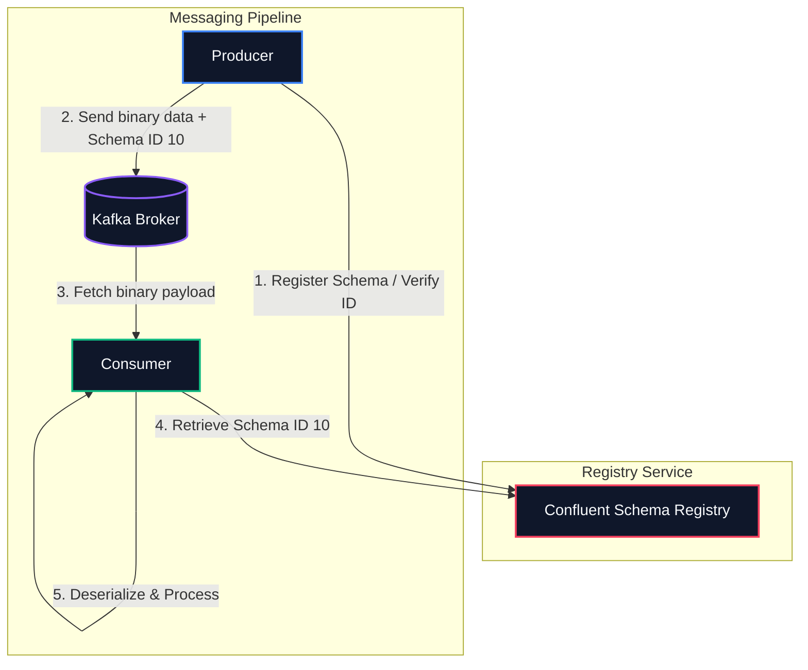

# 📜 Schema Registry & Apache Avro Integration

When multiple microservices communicate using Kafka, enforcing **data contracts (schemas)** is critical. 

In a raw JSON environment, a producer can change a field name (e.g., changing `user_id` to `customerId`) or alter a data type (e.g., changing `amount` from float to string) without warning. This silently crashes downstream consumers in production.

---

## 🏛️ The Schema Registry Architecture

To prevent contract breakage, Confluent designed the **Schema Registry**. It acts as a central repository for storing and managing schema definitions for Kafka topics.



### How it Works:
1.  **Register Schema:** Before publishing, the producer sends its schema definition to the Schema Registry. The registry registers it under a unique **Schema ID** (e.g., ID `10`).
2.  **Binary Serialization:** The producer serializes the record into highly optimized **Avro binary** format. It prepends the 5-byte Magic Byte + Schema ID to the message payload.
3.  **Low Payload Overhead:** The schema definition is **not** included in the message itself, saving massive amounts of network bandwidth and disk storage compared to raw JSON.
4.  **Enforced Parsing:** When the consumer reads the message, it extracts the Schema ID, fetches the corresponding schema from the Registry, and deserializes the binary payload safely.

---

## 📦 What is Apache Avro?

Apache Avro is a data serialization system that stores data in a compact, binary format. Avro schemas are declared using JSON.

### 📝 Example Avro Schema Definition (`order.avsc`)
Save schema definitions as `.avsc` files. Here is our purchase order model represented in Avro:

```json
{
  "type": "record",
  "name": "Order",
  "namespace": "com.example.kafka.avro",
  "doc": "Schema definition for customer purchase orders",
  "fields": [
    {
      "name": "order_id",
      "type": "string",
      "doc": "Unique UUID of the order"
    },
    {
      "name": "customer_id",
      "type": "string",
      "doc": "Alphanumeric customer identifier"
    },
    {
      "name": "amount",
      "type": "double",
      "doc": "Total order charge in USD"
    },
    {
      "name": "timestamp",
      "type": "string",
      "doc": "UTC timestamp in ISO-8601 format"
    },
    {
      "name": "status",
      "type": ["null", "string"],
      "default": null,
      "doc": "Optional transaction fulfillment status"
    }
  ]
}
```

---

## 🔄 Schema Evolution Compatibility Rules

As your applications grow, you will need to modify schemas. Schema Registry enforces compatibility rules to ensure updates do not break existing pipelines.

You can configure compatibility at the registry or per-subject level:

### 1. `BACKWARD` Compatibility (Default)
*   **Definition:** Consumers using the **new** schema can read messages written with the **old** schema.
*   **Rule:** You can delete fields or add optional fields (fields with default values).
*   **Upgrade Strategy:** Upgrade consumers first, then upgrade producers.

### 2. `FORWARD` Compatibility
*   **Definition:** Consumers using the **old** schema can read messages written with the **new** schema.
*   **Rule:** You can add new fields, but you cannot delete existing fields.
*   **Upgrade Strategy:** Upgrade producers first, then upgrade consumers.

### 3. `FULL` Compatibility
*   **Definition:** New and old schemas are fully cross-compatible. Old consumers can read new messages, and new consumers can read old messages.
*   **Rule:** You can only add optional fields, and you cannot delete existing fields.
*   **Upgrade Strategy:** You can upgrade producers and consumers in any order.

---
*Next up, let's explore transaction coordinates and exactly-once execution safety:* **[Exactly-Once Semantics ➡️](./transactional-exactly-once/)**
