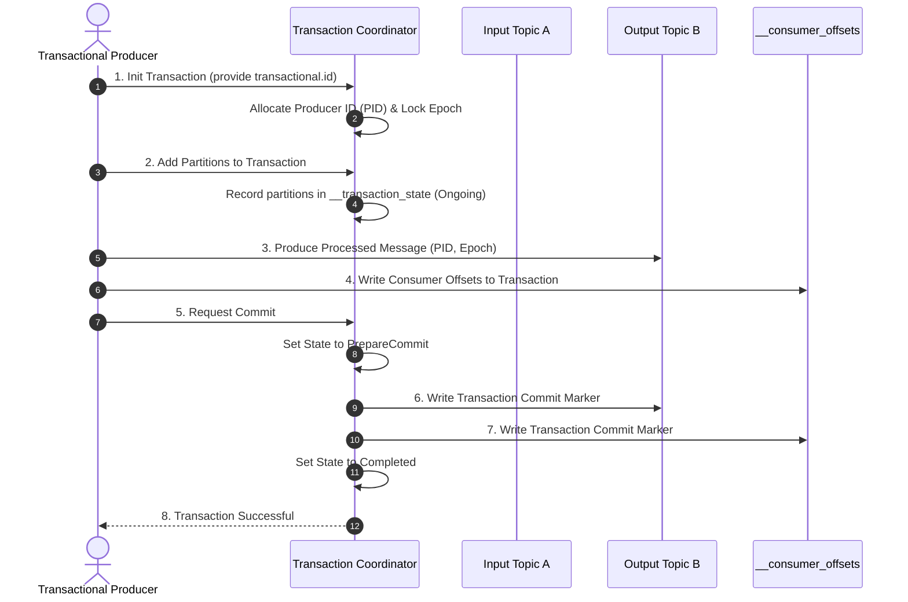

# 🎯 Transactional Exactly-Once Semantics (EOS)

Achieving **Exactly-Once Semantics (EOS)** in distributed systems is often considered one of the hardest challenges in computer science. 

In Apache Kafka, EOS is supported out of the box through **transactions**, enabling applications to process data atomically in a standard **"Read-Process-Write"** loop.

---

## 🔄 The Read-Process-Write Loop

In a typical streaming microservice:
1.  **Read:** Consume messages from input Topic A (Partition 0).
2.  **Process:** Apply business transformations (e.g., deducting an account balance).
3.  **Write:** Produce results to output Topic B (Partition 1) **AND** commit offsets back to `__consumer_offsets` for Topic A.

Without transactions, a crash during step 3 leads to inconsistencies:
*   *If offsets aren't committed:* The input message is re-read, causing duplicates in Topic B (**At-Least-Once**).
*   *If offsets are committed first:* The message is marked processed, but the output in Topic B was never written, resulting in lost data (**At-Most-Once**).

---

## 🧱 The Transaction Coordinator

To achieve atomicity, Kafka introduces a specialized broker called the **Transaction Coordinator**, which manages an internal topic named `__transaction_state`.



---

## ⚙️ How the 2-Phase Commit Works Internally

### 1. Initialization (`InitTransactions`)
Upon startup, the producer registers with the Transaction Coordinator using a persistent, user-configured `transactional.id` (which must be unique across all instances of the application).
*   **PID Allocation:** The coordinator assigns a unique **Producer ID (PID)** and increments the **Epoch Number**.
*   **Zombie Fencing:** If an old, zombie instance of the producer attempts to write, the broker fences it out because its epoch number is outdated, preventing split-brain writes.

### 2. Ongoing State (`BeginTransaction`)
The producer begins a transaction and informs the coordinator before writing to any new partitions. The coordinator logs these partition targets in `__transaction_state` as `Ongoing`.

### 3. Writing and Offsets
The producer publishes data to target topics and writes the input offsets directly inside the transaction boundary.

### 4. Committing (`CommitTransaction`)
*   **Phase 1 (Prepare Commit):** The coordinator writes a `PrepareCommit` state to the transaction log.
*   **Phase 2 (Commit Markers):** The coordinator writes specialized **Commit Markers** (or Abort Markers) directly onto the logs of all participating partitions.
*   **Completion:** The state is marked `Completed` in the transaction log.

---

## 📥 Consumer Isolation Level (`isolation.level`)

Downstream consumers reading from Topic B must configure their ingestion behavior to respect transaction states:

```properties
# Essential configuration for downstream consumers
isolation.level=read_committed
```

### Options:
1.  **`read_uncommitted` (Default):** The consumer reads all messages in offset order, regardless of whether they were part of an aborted transaction or are still in an uncommitted, ongoing state.
2.  **`read_committed`:** The consumer's offset progression blocks at the **Last Stable Offset (LSO)**—the first offset belonging to an active, uncommitted transaction. Once the transaction commits, the consumer resumes ingestion, skipping any aborted messages automatically.

---
*Now that we have covered the advanced patterns, let's explore operations, administration CLI scripts, and security configs in Module 5:* **[05. Operations & Tuning ➡️](../05-operations-and-cheat-sheets/)**
