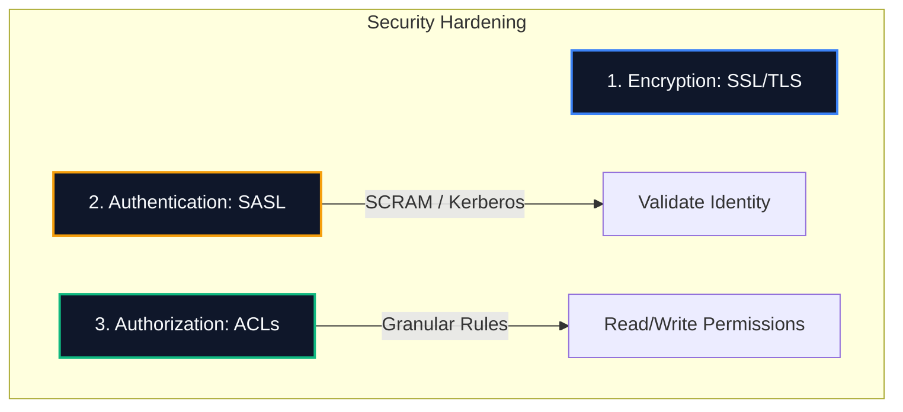

# 🔒 Apache Kafka Security Hardening Manual

By default, standard Kafka environments are completely open: any client can write or read from any topic, and all network transmissions travel in unencrypted plain text. 

Securing a Kafka cluster requires establishing **Encryption** (SSL/TLS), **Authentication** (SASL), and **Authorization** (Access Control Lists).

---

## 🏛️ The Three Security Pillars



---

## 1. SSL/TLS Network Encryption

SSL/TLS encrypts the packet data pathway between producers, consumers, and brokers, protecting transactions from eavesdropping or packet sniffing.

### Setup Checklist
To enable SSL, you must generate keystores and truststores for each node:
1.  **Generate a Certificate Authority (CA):** Used to sign certificates across the cluster.
2.  **Generate a Keystore for each Broker:** Contains the broker's private key and signing certificate.
3.  **Generate a Truststore for Clients:** Contains the CA certificate so clients can verify they are connecting to a legitimate broker.

### Broker `server.properties` Configuration:
```properties
# Enable SSL listener protocols
listeners=SSL://0.0.0.0:9093
advertised.listeners=SSL://broker1:9093

# SSL File Configs
ssl.keystore.location=/var/private/ssl/kafka.server.keystore.jks
ssl.keystore.password=KeystorePassword123
ssl.key.password=KeyPassword123
ssl.truststore.location=/var/private/ssl/kafka.server.truststore.jks
ssl.truststore.password=TruststorePassword123

# Require client authentication (Mutual TLS)
ssl.client.auth=required
```

---

## 2. Client Authentication (SASL)

SASL (Simple Authentication and Security Layer) enforces identity verification during socket establishment. Modern Kafka supports three primary SASL mechanisms:

### A. SASL/PLAIN
*   **Concept:** Uses static username and password strings passed over an SSL-encrypted socket.
*   **Usage:** Simple to set up, but credentials must be hardcoded inside JAAS configuration files on brokers.

### B. SASL/SCRAM (Salted Challenge Response Authentication Mechanism)
*   **Concept:** Salted username and passwords stored inside the KRaft metadata log or ZooKeeper.
*   **Resiliency:** Highly secure because actual passwords are never transmitted over the network (uses SHA-256 or SHA-512 hashes).
*   **Administration:** Admins can dynamically add or revoke user credentials using `kafka-configs` script without restarting brokers!

### C. SASL/GSSAPI (Kerberos)
*   **Concept:** Integrates with centralized corporate directories (Microsoft Active Directory or OpenLDAP).
*   **Usage:** The gold standard for financial institutions and enterprise deployments, utilizing Kerberos ticket-granting structures.

---

## 3. Granular Authorization (ACLs)

Once a client is successfully authenticated, **Access Control Lists (ACLs)** dictate what actions that authenticated user principal can perform.

ACLs are managed using the `kafka-acls` command tool:

### 1. Grant Producer Permissions to a User
Allow user `sales-app` to **Write** messages to a specific topic `billing-orders`:
```bash
docker exec -it kafka-broker-1 kafka-acls \
  --add --allow-principal User:sales-app \
  --operation Write \
  --topic billing-orders \
  --bootstrap-server localhost:9092
```

### 2. Grant Consumer Permissions to a User
Allow user `accounting-service` to **Read** from topic `billing-orders` and coordinate with consumer group `billing-group`:
```bash
docker exec -it kafka-broker-1 kafka-acls \
  --add --allow-principal User:accounting-service \
  --operation Read \
  --topic billing-orders \
  --group billing-group \
  --bootstrap-server localhost:9092
```

### 3. Describe All Configured ACLs
```bash
docker exec -it kafka-broker-1 kafka-acls \
  --list \
  --bootstrap-server localhost:9092
```

### 4. Revoke/Delete an ACL
Remove read permissions for user `accounting-service`:
```bash
docker exec -it kafka-broker-1 kafka-acls \
  --remove --allow-principal User:accounting-service \
  --operation Read \
  --topic billing-orders \
  --bootstrap-server localhost:9092
```
