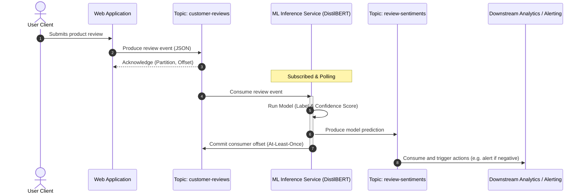

# 🤖 Module 6: Apache Kafka for AI & Machine Learning Integration

Modern AI and Machine Learning systems require real-time, low-latency, and highly reliable data pipelines. Because models are only as good as the data they receive, **Apache Kafka** serves as the central nervous system for production MLOps and LLM architectures.

This module covers how Kafka bridges the gap between streaming event feeds, live model inference, and vector database ingestion for Retrieval-Augmented Generation (RAG).

---

## 🏗️ Architectural Blueprints

### 1. Real-Time Event-Driven Model Serving
Rather than wrapping models in synchronous HTTP REST APIs (which can easily suffer from head-of-line blocking, connection drops, and service crashes under high volume), production MLOps pipelines use Kafka topics as decoupled request/response buffers.



### 2. Streaming Ingestion for Retrieval-Augmented Generation (RAG)
For LLM-powered applications, document sources (e.g., wiki updates, Slack messages, database CDC events) must be chunked, embedded, and indexed in a Vector Database in real-time.


---

## 🗂️ Module Contents & Code Examples

This module provides three executable Python scripts demonstrating these pipelines:

| Script | Purpose | Key Concept |
| :--- | :--- | :--- |
| [**`simulation_producer.py`**](./simulation_producer.py) | Streams user reviews and raw documentation snippets. | Safe, idempotent multi-topic streaming. |
| [**`realtime_inference_service.py`**](./realtime_inference_service.py) | Subscribes to reviews, runs a Sentiment Analysis model, and outputs predictions. | At-Least-Once manual commits, Model pipeline serving. |
| [**`streaming_rag_ingester.py`**](./streaming_rag_ingester.py) | Subscribes to docs, generates dense vector embeddings, and writes to a local vector store. | Vector space embedding generation, DB chunk indexing. |

> [!NOTE]
> **Zero-Configuration Portability:** To guarantee these scripts run out-of-the-box on any hardware (without requiring GPU acceleration or downloading gigabytes of PyTorch weights), both consumer scripts feature a **fallback logic system**. If Hugging Face NLP or SentenceTransformer libraries are missing, they auto-switch to a keyword-heuristic classifier and deterministic vector generator, letting you study the Kafka stream logic instantly.

---

## 🚀 Quick Start: Running the AI/ML Pipeline

### 1. Boot up Apache Kafka
Ensure you have a Kafka cluster running. You can launch the multi-broker setup from [Module 2](../02-cluster-setups/kraft-multi-node-with-ui/):
```bash
# From the root repository directory
cd 02-cluster-setups/kraft-multi-node-with-ui
docker compose up -d
```

### 2. Setup the Python Environment
Go back to the AI/ML module folder, create a virtual environment, and install dependencies:
```bash
cd ../../06-ai-and-ml-integration
python3 -m venv venv
source venv/bin/activate
pip install -r requirements.txt
```

### 3. Start the Inference Service
In a separate terminal pane (with the virtual environment activated):
```bash
python realtime_inference_service.py
```

### 4. Start the RAG Document Ingester
In another terminal pane (with the virtual environment activated):
```bash
python streaming_rag_ingester.py
```
This script will create and update a local Vector Store Index file (`vector_store_index.json`).

### 5. Launch the Simulation Producer
Now start streaming data to trigger the AI/ML services:
```bash
python simulation_producer.py
```

Observe the terminals:
*   The **Producer** generates mock customer reviews and document chunks.
*   The **Inference Service** receives the reviews, evaluates their sentiment (Positive/Negative/Neutral), calculates the latency, and pushes the results downstream.
*   The **RAG Ingester** receives document chunks, generates 384-dimension vector embeddings, and indexes them in `vector_store_index.json`.

---

## ⚙️ Operational Tuning for High-Volume AI Workloads

Running ML models over event streams changes how you configure Kafka client properties. Keep these best practices in mind:

### 1. Throughput vs. Inference Latency
*   **Batch Size:** Models run significantly faster when processing batches of records (e.g., executing a GPU forward-pass on 32 reviews instead of 1). Adjust the consumer's poll size or buffer records in-memory before running the model.
*   **Consumer Poll Timeout:** Set a reasonable poll interval. If a batch takes too long to run inference, the coordinator may assume the consumer died and trigger a partition rebalance. Tune `max.poll.interval.ms` (e.g., set it to 300000ms / 5 minutes) to avoid rebalance loops.

### 2. Delivery Semantics
*   **Exactly-Once vs At-Least-Once:** In AI pipelines, **At-Least-Once** is usually preferred. If a crash occurs, re-running a sentiment prediction or indexing a document chunk is harmless because vector stores and analytics databases can overwrite or upsert values by key (`review_id` or `chunk_id`).
*   **Dead Letter Queues (DLQ):** Model inference can fail on malformed strings or unsupported languages. Wrap your model inference code block in `try-except` statements. If a record fails, produce it to a DLQ topic (e.g. `customer-reviews-dlq`) and **commit the offset anyway** so the service doesn't get blocked.

### 3. Scaling Consumers
*   Since model inference is CPU/GPU intensive, a single consumer thread will likely become the bottleneck.
*   Scale processing by increasing the number of partitions in the input topic (e.g., to 12 partitions) and running multiple consumer processes inside the same consumer group (`group.id: sentiment-inference-service`).
