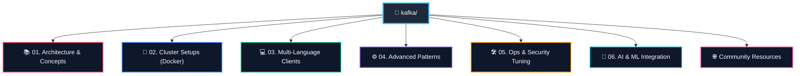

# ⚡ Apache Kafka Mastery: The Ultimate Production Guide

Welcome to the **Apache Kafka Mastery** repository! This is a comprehensive, production-grade learning and implementation resource designed to take you from a complete beginner to a seasoned Kafka architect.

Unlike typical tutorials that stop at a single local broker, this repository bridges the gap between deep theoretical concepts and **battle-tested, production-ready systems**.

---

## 🗺️ Learning & Implementation Roadmap



---

## 🗂️ Table of Contents

| Module / Resource | Description | Key Focus Areas |
| :--- | :--- | :--- |
| [**`01-architecture-and-concepts`**](./01-architecture-and-concepts/) | Theoretical foundation and internal designs. | Partitions, Consumer Rebalancing, KRaft vs Zookeeper, EOS |
| [**`02-cluster-setups`**](./02-cluster-setups/) | Instantly bootable local development clusters. | Docker-compose, KRaft clusters, Kafka-UI, Prometheus & Grafana |
| [**`03-code-examples`**](./03-code-examples/) | Ready-to-run robust client implementations. | Python, Java Spring Boot, Go, Node.js (KafkaJS) |
| [**`04-advanced-patterns`**](./04-advanced-patterns/) | Resilient system design patterns for enterprise. | Dead Letter Queues (DLQ), Avro & Schema Registry, Transactions |
| [**`05-operations-and-cheat-sheets`**](./05-operations-and-cheat-sheets/) | DevOps hardening, administration, and tuning. | CLI Cheat Sheet, Latency vs Throughput Tuning, SSL & SASL |
| [**`06-ai-and-ml-integration`**](./06-ai-and-ml-integration/) | Streaming AI/ML architectures and integration patterns. | Real-time Inference, LLM Ingestion (RAG), Embedding Pipelines |
| [**`COMMUNITY_RESOURCES.md`**](./COMMUNITY_RESOURCES.md) | Highly curated external learning materials. | Popular YouTube channels, Substack, Medium, GitHub repos |

---

## 🚀 Quick Start: Spin Up Your First Cluster

If you want to immediately start producing and consuming messages, you can launch a 3-broker KRaft cluster with a beautiful Web UI in under 10 seconds:

```bash
# 1. Navigate to the multi-node cluster setup
cd 02-cluster-setups/kraft-multi-node-with-ui

# 2. Start the cluster using Docker Compose
docker compose up -d
```

Once running:
*   **Brokers:** Available at `localhost:9092`, `localhost:9093`, and `localhost:9094`
*   **Web Management UI:** Navigate to **[http://localhost:8080](http://localhost:8080)** in your browser to inspect topics, brokers, consumers, and messages visually!

To clean up:
```bash
docker compose down -v
```

---

## 💡 Key Highlights of This Guide

> [!NOTE]
> **KRaft (Kafka Raft Metadata Mode) Standard:** All cluster setups and architectural notes are fully updated to Kafka 3.x+ utilizing **KRaft mode**, discarding the deprecated ZooKeeper dependency completely.

> [!TIP]
> **Production-Ready Settings:** The configuration tuning guides inside `05-operations-and-cheat-sheets` compile standard performance profiles for **Maximum Throughput**, **Ultra-Low Latency**, and **Exactly-Once Resiliency**.

---

## 📬 Contributing & Feedback

This repository is designed to be highly practical. If you find a bug in any code examples, have questions about the architectures, or want to suggest more advanced patterns (such as Kafka Streams or Connect setups), feel free to open a Pull Request or create an Issue.

---
*Created and maintained by **Niraj Bajpai** ([nbajpai-code](https://github.com/nbajpai-code))*
